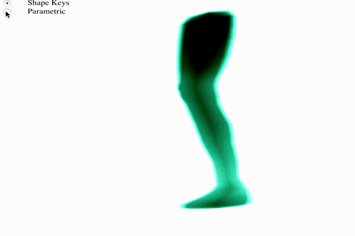

## README

I wrote this with WebGL. It shouldn't have any CORS issues.

Of note, I include the [Tiny WebGL Helper Library (TWGL)](https://twgljs.org/) which provides syntactic sugar and allows my code to be less verbose than plain webgl. It doesn't add any major features, so I felt safe adding it.

I also include the [glMatrix](http://glmatrix.net/) library, which is a library with simple matrix operations.

This project shows the animation of leg using two different methods - parametric matrix multiplication and shape keys.

##### Files:
- `project4.html` - The main html file. Contains shaders and rendering functions.
  - `project4.html` also contains the an OBJ file in a textarea. (I would have put these in other files, but AJAX doesn't work on local files, and I wanted this to be able to run without a server)
- `readOBJ.js` - A stripped down OBJ file reader. Will fail on *anything* complicated
- `style.css` - contains minimal styling for `project4.html`

You should just be able to open `project4.html` in a browser (I tested it in Chrome and Safari) to run the project. Or navigate to https://ezraezra101.github.io/animation-projects/project4_bones/project4.html

You should just be able to open project4.html in a browser (I tested it in Chrome) to run the project.

If the cube is somewhat off the screen, you will probably be able to fix it by resizing the page.

If you still can't get it to work, there's a screen capture in out.gif

