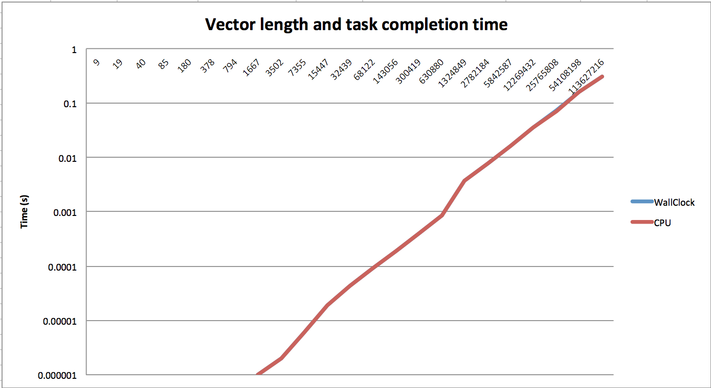
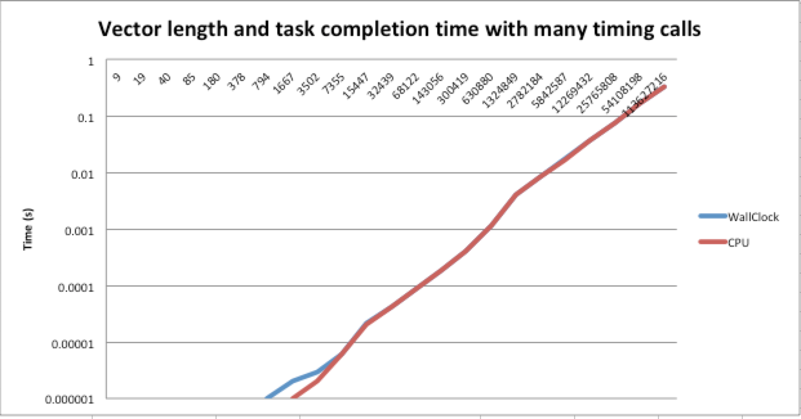

# CPSC 424/524 Spring 2018 - Assignment 1
Ezra Davis (epd9)

#### Execution and development environment
The Intel compiler must be loaded. On the Grace cluster, I perform the following command to do so:

```bash
module load Langs/Intel/2015_update2
```

## Exercise 1: Division Performance

##### Steps to compile, link, and run
```bash
make run-pi
```
The above should be a sufficient instruction to compile, build, and run all versions of the PI approximating program.

#### Outputs from executing program

```
[epd9@c01n01 assignment1]$ make run-pi
make[1]: Entering directory `/project/fas/cpsc424/epd9/assignment1'
icc -g -O0 -fno-alias -std=c99 -I/home/fas/cpsc424/ahs3/utils/timing /home/fas/cpsc424/ahs3/utils/timing/timing.o -o pi-O0 pi.c
icc -g -O1 -fno-alias -std=c99 -I/home/fas/cpsc424/ahs3/utils/timing /home/fas/cpsc424/ahs3/utils/timing/timing.o -o pi-O1 pi.c
icc -g -O3 -xHost -fno-alias -std=c99 -I/home/fas/cpsc424/ahs3/utils/timing /home/fas/cpsc424/ahs3/utils/timing/timing.o -o pi-O3 pi.c
icc -g -O3 -no-vec -no-simd -fno-alias -std=c99 -I/home/fas/cpsc424/ahs3/utils/timing /home/fas/cpsc424/ahs3/utils/timing/timing.o -o pi-O3-no-simd pi.c
./pi-O0
CPU	5.810068	WallClock	5.807218
./pi-O1
CPU	3.735815	WallClock	3.732401
./pi-O3-no-simd
CPU	3.733449	WallClock	3.732109
./pi-O3
CPU	3.732205	WallClock	3.731845
make[1]: Leaving directory `/project/fas/cpsc424/epd9/assignment1'
```


> Try to explain your results briefly by relating them to the architecture of the processor. (See class notes or look up the Intel Ivy Bridge architecture on the web. You could also look at the older X5560 Nehalem architecture, instead.) I’m looking for a conceptual answer here, preferably with some quantitative backup that justifies the answer. There may be more than one reasonable explanation.

My immediate impression is that beyond optimization level 1, no improvement is made when increasing the optimization level. This means that it didn't take advantage of SIMD operations - which I find a little odd as it was introduced in the previous Sandy Bridge architecture. I also use `long double`s instead of anything more efficient, which probably cuts down on the optimization possible. Upon further investigation, apparently, there are no SIMD operations in x86.[1]

I imagine that optimization level 1 performs loop unrolling, and inlines my function (not that that has a significant impact), and that there isn't too much more optimization possible - at this point I'm using all of the `long double` capable ALUs at full capacity. (e.g. merging constants isn't useful, nor is complex branch planning or loop peeling)

[1] https://stackoverflow.com/questions/37109647/is-openmp-vectorization-operations-on-long-double-datatype-not-possible

> Use timings of your code (and/or some modest variations of it) to estimate the latency of the divide operation (measured as a number of CPU cycles to obtain a divide output). Be sure to explain how you got your estimate. For this part of the problem, you may assume that the processor runs at clock rate of 2.2 GigaHertz, and that the cycle time is the reciprocal of the clock rate. (You can find out the base clock speed and lots more information about the node by running: `cat /proc/cpuinfo`

After editing `pi.c` to avoid the divide step, I end up with the result of the program as follows:

```
[epd9@c01n01 assignment1]$ make run-pi
make[1]: Entering directory `/project/fas/cpsc424/epd9/assignment1'
icc -g -O0 -fno-alias -std=c99 -I/home/fas/cpsc424/ahs3/utils/timing /home/fas/cpsc424/ahs3/utils/timing/timing.o -o pi-O0 pi.c
icc -g -O1 -fno-alias -std=c99 -I/home/fas/cpsc424/ahs3/utils/timing /home/fas/cpsc424/ahs3/utils/timing/timing.o -o pi-O1 pi.c
icc -g -O3 -xHost -fno-alias -std=c99 -I/home/fas/cpsc424/ahs3/utils/timing /home/fas/cpsc424/ahs3/utils/timing/timing.o -o pi-O3 pi.c
icc -g -O3 -no-vec -no-simd -fno-alias -std=c99 -I/home/fas/cpsc424/ahs3/utils/timing /home/fas/cpsc424/ahs3/utils/timing/timing.o -o pi-O3-no-simd pi.c
./pi-O0
Error: Approximate value isn't PI: 5.333333
CPU	5.396426	WallClock	5.394586
./pi-O1
Error: Approximate value isn't PI: 5.333333
CPU	0.764766	WallClock	0.764652
./pi-O3-no-simd
Error: Approximate value isn't PI: 5.333333
CPU	0.832376	WallClock	0.832259
./pi-O3
Error: Approximate value isn't PI: 5.333333
CPU	0.763196	WallClock	0.762209
make[1]: Leaving directory `/project/fas/cpsc424/epd9/assignment1'
```

I perform `pow(2, 29);`, or 536870912, iterations. This means that I perform 536870912 more divisions in the original set of results than the second, and I can calculate the cycles per division via `(old_total_cpu_time - new_cpu_time) * cycles_per_second / 536870912`. Assuming that the cycles per second is 2.2GHz, I get approximately:

- 1.7 cycles for O0
- 12.2 cycles for O1
- 11.9 cycles for O3 without SIMD
- 12.2 cycles for O3 with SIMD

Which is truely unexpected - I simply assumed that higher optimization levels would reduce the latency of the divide operation compared to no optimization.


## Exercise 2: Vector Triad Performance

##### Steps to compile, link, and run
```bash
make vector
./vector
```

#### Outputs from executing program
```
Trial 	Length 	WallClock 	CPU 	TotalCPU 	TotalWallClock 	TotalIterations
3 	9 	0.000000 	0.000000 	1.100711 	1.101748 	67108863
4 	19 	0.000000 	0.000000 	1.743367 	1.743931 	134217727
5 	40 	0.000000 	0.000000 	1.534885 	1.533225 	67108863
6 	85 	0.000000 	0.000000 	1.386595 	1.386797 	33554431
7 	180 	0.000000 	0.000000 	1.167282 	1.168295 	16777215
8 	378 	0.000000 	0.000000 	1.176864 	1.177886 	8388607
9 	794 	0.000000 	0.000000 	1.231475 	1.231617 	4194303
10 	1667 	0.000001 	0.000001 	1.218594 	1.217640 	1048575
11 	3502 	0.000002 	0.000002 	1.299921 	1.299049 	524287
12 	7355 	0.000006 	0.000006 	1.568964 	1.569327 	262143
13 	15447 	0.000019 	0.000019 	1.250664 	1.251739 	65535
14 	32439 	0.000043 	0.000043 	1.395992 	1.396205 	32767
15 	68122 	0.000088 	0.000088 	1.434226 	1.435460 	16383
16 	143056 	0.000184 	0.000184 	1.504272 	1.504579 	8191
17 	300419 	0.000394 	0.000394 	1.613214 	1.614604 	4095
18 	630880 	0.000851 	0.000848 	1.741810 	1.736297 	2047
19 	1324849 	0.003727 	0.003723 	1.904667 	1.902281 	511
20 	2782184 	0.007863 	0.007830 	2.004995 	1.996654 	255
21 	5842587 	0.016277 	0.016170 	1.025441 	1.018733 	63
22 	12269432 	0.035540 	0.035343 	1.101734 	1.095639 	31
23 	25765808 	0.071937 	0.071596 	1.079056 	1.073935 	15
24 	54108198 	0.158943 	0.158215 	1.112601 	1.107507 	7
25 	113627216 	0.311055 	0.309438 	2.177388 	2.166069 	7
```



> Try to explain the variations in terms of the processor architecture, by computing and discussing the apparent memory bandwidth that your data show near the variations in your plot. [Hint: You can estimate the apparent bandwidth, often expressed in GB/sec, as the product of Gflops and bytes/flop.]

The completion time (unsurprisingly) is nearly linear compared to vector length. If we look at trial 25, it clearly takes 0.31106/113627216 seconds (in latency) to access/save and operate on a single element in one of our 4 vectors.

Each loop also takes roughly 23.96 cycles (again, using a 2.2GHz clock), which given the addition and multiplication time even on an older Nehalem processor (around 4 cycles), clearly indicates that performance is memory limited.

More practically, we get `113627216flops / 0.31106sec * 4bytes/float`, which is a little under 1.37GB/sec (Not using drive maker's GB, of course).


Interestingly, if unsurprising, in an older version of my code where I made more timing calls, the wallclock time was higher than the CPU time, especially for shorter vectors. I assume this is because the kernel must block for IO to access the clock, or that (reasonably unlikely) another process takes over when we trap to the kernel.



