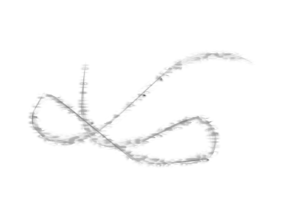

## Assignment 3: Design and Implementation of Custom Brushes and Paper
Ezra Davis

(I've stored my files in `Sketch code/js/brushes/brush[1,2,3].js]` and `Sketch code/js/brushes/paper[1,2,3].js]`. `paper1.js` contains my Perlin noise implementation.

### Resources
Mr. Doob's original Harmony project <http://mrdoob.com/projects/harmony/>

###### For ideas on possible brushes:
Perfection Kills: Exploring canvas drawing techniques by kangax <http://perfectionkills.com/exploring-canvas-drawing-techniques/>

###### For Wacom tablet integration: (it's two lines of code)
Ploma: High-fidelity ballpoint pen rendering for pressure sensitive tablets <https://github.com/evhan55/ploma> (appears to be based on harmony)

###### Perlin noise:
* Building Up Perlin Noise guide by Andrew Kensler <http://eastfarthing.com/blog/2015-04-21-noise/>
* Noise Functions and Map Generation
from Red Blob Games <https://www.redblobgames.com/articles/noise/<introduction.html>
* The Book of Shaders: Noise by Patricio Gonzalez Vivo & Jen Lowe <https://thebookofshaders.com/11/>

### Brush 1: Calligraphy pen
This brush's width depends on the angle of the stroke, creating a calligraphy pen effect. It also is slightly smoother than the simple brush - each new point is a weighted average of previous ones.

Once I had figured out the rough implementation of my features, I examined how other fountain pen tools did things:

- Many other pen tools use a recangular shaped brush, and draw that rectangle often, but I decided to resize the stroke itself, depending on the angle between it and the stroke's previous position. This can create "blots" at the end of a stroke, when the artist stops moving the brush, much like a real pen, so I'll claim that is an undocumented feature instead of a bug.

- Other, more complex tools use splines or Bezier curves for smoothing, but weighted averaging was sufficient for my purposes, and is a *lot* simpler.

Figuring out smooth interpolation of size was a little tricky - I ended up creating many new canvas strokes for each 'line segment' in a pen stroke.

Looking back on it, it would have been much easier to implement a calligraphy pen effect as a paper instead of a brush.

### Brush 2: Slighly sketchy
If you draw two parallel lines with the sketchy brush, you get a patch in the center filled in, but the areas right next to your lines is completely blank, and there is a strong cutoff.
[Picture]

This bothered me, so I set out to fix it by randomizing the gap, which gives a rather nice effect.
[Picture]

This didn't seem like enough to justify a unique brush, so I thought about other changes I might want to make to the sketchy brush, and came up with two (that weren't in Mr. Doob's original Harmony editor):

1. Not connecting from one stroke to a previous one.

2. Only connect parts of the stroke that are going in roughly the same direction.

To only connect parts of the stroke that are in the same direction, I keep track of the direction of each of the segments in the `brush2.points` array, and only draw a line between points that have a direction whose dot product with the current segment's direction is high. I stop attempting to connect segments when the dot product becomes negative, and erase the `points` array when a stroke finishes.

This creates a nice effect that is slightly more subtle than the sketchy brush.

### Brush 3: "Ashes" brush - Perlin noise backdrop
This brush works well at larger brush sizes.

I wanted to explore alternate ways of drawing lines with this brush.
Instead of drawing a stroke, I figure out the distance any point is to the line segment between the previous and current point, and use that to control the effect of this brush. While it's not obvious that I got the 'caps' of the line segments smooth (creating a sort of pill-like shape), I spent a while figuring out when to switch from using the distance to the line segment to the distance of the closest endpoint.

Originally, I wanted this brush to look almost like a tear in the paper, so I wanted to introduce some noise. I had Perlin noise from my experiments with the papers, so I introduced a noise term to my distance falloff function (it's actually the reciprocal of the noise), which gave me a neat effect.

### Paper 1: Irregular Absorbant paper

I was trying to create a paper that would be ink-absorbant, and sort of look like blotting paper. It didn't work out that well initially.

This paper uses a convolution gaussian filter to create a gaussian blur. Unfortunately, this is reasonably slow, even when I perform it as two one dimensional convolutions. It also gets more computationally expensive as I have more opaque pixels.

The gaussian blur just wasn't looking good, so I combined it with some Perlin noise (implemented in this file, even though, oddly enough, I developed it for the 2nd paper), and added the original strokes canvas back in to get more distinct lines. This improved it a lot and gives a nice runny-ink effect.

### Paper 2: Mirror paper

Initially, for this paper, I had wanted to do something with Perlin noise - which I still have in the background, if subtly. Eventually, I ended up incorporating noise into the other paper and brush 3, so I decided that I needed to do something else. Then I hit upon the idea of mirroring. It was remarkably simple to implement - just changing the context's scale and a `context.drawImage` call. Despite that I think it's surprisingly useful.

I also added a slight texture to the background, and a guiding line down the center.

